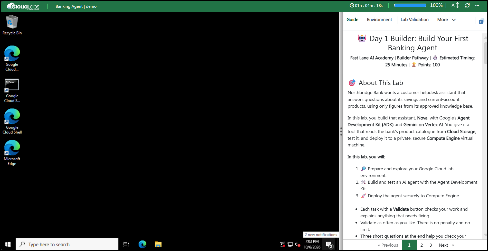
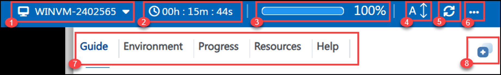
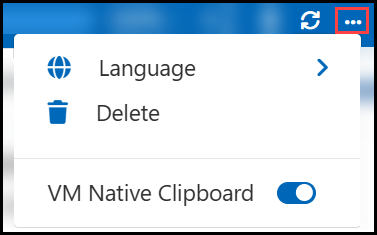
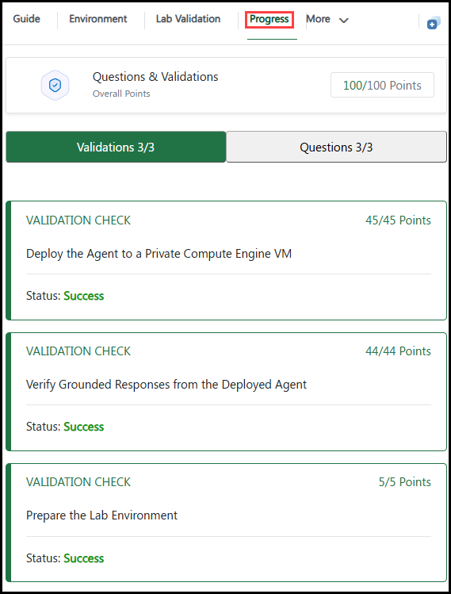
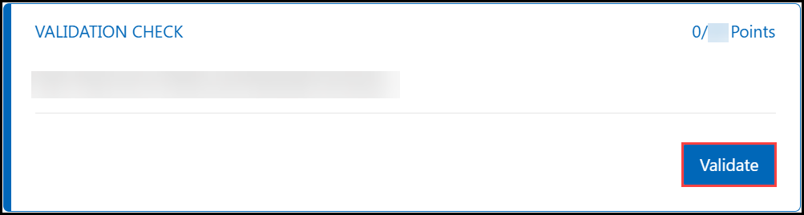

<h1 align="center">🎁 Day 1: Jingle Awakens 🔔</h1>

<b>❄️ The 12 Days of AI Christmas ❄️</b> | <b>🛷 Track A: Developer</b> | ⏱️ <b>Estimated Timing: 60 Minutes</b> | 🏆 <b>Points: 100</b> | 🎖️ <b>Badge: Elf Developer</b>

🔔 ✨ 🦌 🎅 🦌 ✨ 🔔

---

## 🎅 About This Lab

It's the **Christmas rush** at **North Pole Gifts** 🎁 and the customer-support elves 🧝 can't keep up. Santa's mission for you: **wake up Jingle** 🔔, the North Pole's first AI customer-support agent, built with Google's **Agent Development Kit (ADK)** in Python on **Gemini**.

Jingle must answer customers' questions about **gift tracking**, **delivery address changes**, **returns** and the **last Christmas delivery**, and must never invent an answer.

**🧭 How this lab works**

- 🎯 This is a **challenge lab**: each challenge gives you a **goal**, the **rules** your solution must follow and a few **hints**. There are no copy-and-paste steps.
- ✅ The Elf Validators check your **result**, not the commands you used. Validate as often as you like; there is no penalty and no limit.
- 🎖️ Complete every challenge to earn the **Elf Developer** badge.
- 🧠 A short Elf Knowledge Check closes the lab.

---

## 🗺️ The Road to Save Christmas

Jingle's story runs across all twelve days. Today, Jingle awakens.

| Stop | Where | Status |
|:---:|---|:---:|
| 1 | 🎄 **North Pole Command Center** | 📍 **Today** |
| 2 | 📚 **Santa's Knowledge Vault** | 📍 **Today** |
| 3 | 🧸 **Toy Workshop** | 📍 **Today** |
| 4 | 🔐 **Santa's Vault** | 📍 **Today** |
| 5 | 😈 **Grinch Attack** | 🔜 Coming soon |
| 6 | 🧝 **Elf Agent HQ** | 🔜 Coming soon |
| 7 | 🛷 **Rudolph Logistics Center** | 🔜 Coming soon |
| 8 | 🚫 **Rogue Workshop** | 🔜 Coming soon |
| 9 | 🔎 **North Pole SOC** | 🔜 Coming soon |
| 10 | 🛡️ **Christmas Shield** | 🔜 Coming soon |
| 11 | 🌟 **Gemini Enterprise** | 🔜 Coming soon |
| 12 | 🎅 **SAVE CHRISTMAS** | 🏁 Finale |

---

## 🖥️ Lab Environment

The lab window is split into two parts:

- **Left side:** your lab virtual machine (VM), a Windows workstation with a browser.
- **Right side:** the lab guide, with the steps to complete each task.

Your environment is an **isolated Google Cloud project** created only for you. It has been pre-provisioned with:

| Resource | Value |
|---|---|
| ☁️ **Project ID** | <inject key="ProjectId" enableCopy="true"/> |
| 🌍 **Region** | <inject key="Region" enableCopy="true"/> |
| 📚 **Santa's Knowledge Vault** | <inject key="KbBucket" enableCopy="true"/> |
| 🔐 **Jingle's service account** | <inject key="AgentServiceAccount" enableCopy="true"/> |

---

## 🧭 Lab Window Controls

| # | Control | Use |
|:---:|---|---|
| 1 | **VM name** | Shows the lab VM you are connected to. |
| 2 | **Timer** | Time remaining in your lab session. |
| 3 | **Progress bar** | Your progress through the lab. |
| 4 | **A↕** | Change the text size of the lab guide. |
| 5 | **Refresh** | Reconnect the VM if the screen stops responding. |
| 6 | **More (...)** | Language, Delete and VM Native Clipboard options. |
| 7 | **Lab guide menu** | Guide, Environment, Progress, Resources and Help. |
| 8 | **Split window** | Split the lab guide and the VM into separate windows. |

### 6️⃣ More Options

| Option | Use |
|---|---|
| 🌍 **Language** | Switch the lab language, if multi-language support is enabled. |
| 🗑️ **Delete** | Delete the environment once your lab is complete. |
| 📋 **VM Native Clipboard** | Allows copying files within the VM. While it is on, text copied from your local PC cannot be pasted into the VM using keyboard shortcuts. You can turn it off at any time from **More (...)**. |

### 7️⃣ Lab Guide Menu

| Option | Use |
|---|---|
| 📖 **Guide** | All tasks and lab information. |
| 🔑 **Environment** | All required credentials and lab details. |
| 📈 **Progress** | Your points for validations and questions. |
| ⚙️ **Resources** | Start and stop the lab VM. |
| ❓ **Help** | Support information. |

### 📈 Progress

The **Progress** tab shows your overall points, with separate views for **Validations** and **Questions**.

### 📄 Page Navigation

Use **Previous**, the page numbers and **Next** at the bottom of the guide to move between pages.

---

## ✅ Validate Your Work

1. Complete the task.
1. Scroll to the **Validation Check** under the task.
1. Click **Validate**.

- 🎉 On success, the status shows **Success** and the points are added to your **Progress**.
- 🔧 If a check fails, read the message, fix the issue and click **Validate** again.

> 💡 **Tip:** The first task, **Prepare the North Pole**, is also a **Validate** button. Click it before anything else. It wakes up your North Pole Command Center.

---

## 🔐 Sign In to Google Cloud

1. On the lab VM desktop, double-click the **Google Cloud Console** shortcut.
1. Sign in with the following credentials:

    | Detail | Value |
    |---|---|
    | 👤 **Username** | <inject key="AzureADUserEmail" enableCopy="true"/> |
    | 🔒 **Password** | <inject key="AzureADUserPassword" enableCopy="true"/> |

1. If prompted, accept the **Terms of Service**.
1. From the project selector, select your project <inject key="ProjectId" enableCopy="false"/>.

> ⚠️ **Note:** Use only the credentials above. Do not sign in with a personal Google account.

---

## 🔌 Connect Using RDP (Optional)

To use your own RDP client instead of the browser-based VM, connect with these details:

| Detail | Value |
|---|---|
| **Computer** | <inject key="vmPublicIp" enableCopy="true"/> |
| **Username** | <inject key="vmUsername" enableCopy="true"/> |
| **Password** | <inject key="vmPassword" enableCopy="true"/> |

---

## 🆘 Support Contact

The CloudLabs support team is available 24/7 via email and live chat.

- 📧 **Email:** <a href="mailto:cloudlabs-support@spektrasystems.com">cloudlabs-support@spektrasystems.com</a>
- 💬 **Live chat:** <a href="https://support.cloudlabs.ai/isv">https://support.cloudlabs.ai/isv</a>

---

Click **Next** to begin your journey to the North Pole. 🛷

## 🎅 Happy Learning, and Merry Christmas! 🎄
